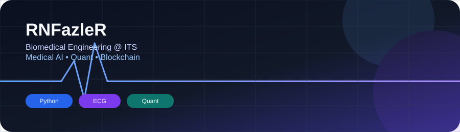

  

# Rifat Naufal Fazle Rabb

**Biomedical Engineering Student @ Institut Teknologi Sepuluh Nopember (ITS)**

  
  
  

---

### About Me

I'm a Biomedical Engineering student applying signal processing and data-driven methods to medical signals, with a growing interest in quantitative research and blockchain systems.

- 🫀 **Medical AI** — ECG/EMG signal processing, time-frequency analysis (STFT, CWT)
- 📊 **Quant Research** — statistics, backtesting, Python
- ⛓️ **Blockchain** — DeFi mechanics, tokenomics, on-chain analytics
- 🌱 **Currently learning** — Digital Signal Processing, Medical Informatics, Financial Engineering, Smart Contract Architecture

---

### Tech Stack

  

---

### Featured Projects

| Repo | Description | Stack |
|---|---|---|
| [**biomedical-signal-time-frequency-analysis**](https://github.com/RNFazleR/biomedical-signal-time-frequency-analysis) | Interactive Streamlit app for time-frequency analysis (STFT & CWT) of biomedical signals — synthetic, sinusoidal, or uploaded ECG data. |  |
| [**Biomedical-Signal-Analysis**](https://github.com/RNFazleR/Biomedical-Signal-Analysis) | Gait analysis using surface EMG — preprocessing, envelope extraction, activation detection, and time-frequency analysis. |  |
| [**portfolio**](https://github.com/RNFazleR/portfolio) | Personal portfolio site. |  |

---

### GitHub Stats

  
  

  

---

Always happy to connect on Medical AI, Quant research, or Blockchain — feel free to reach out.

